# 🏗️ System Architecture & Technical Documentation

## 📊 High-Level Architecture Overview

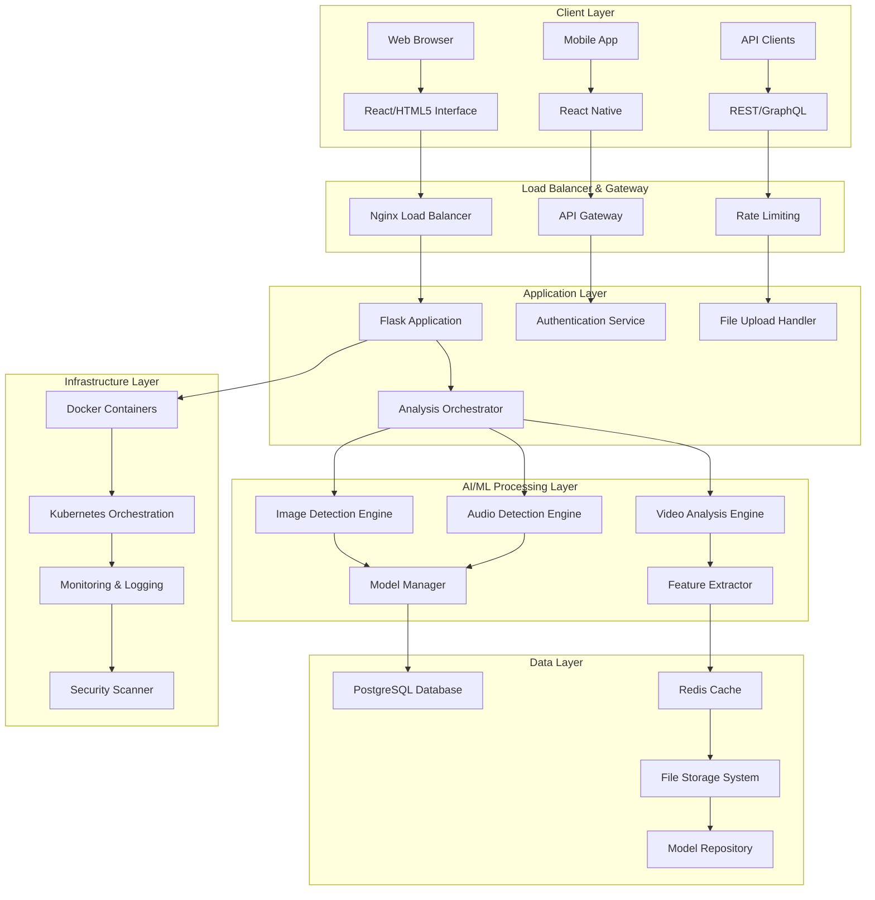

## 🔧 Component Architecture

### 1. Frontend Architecture

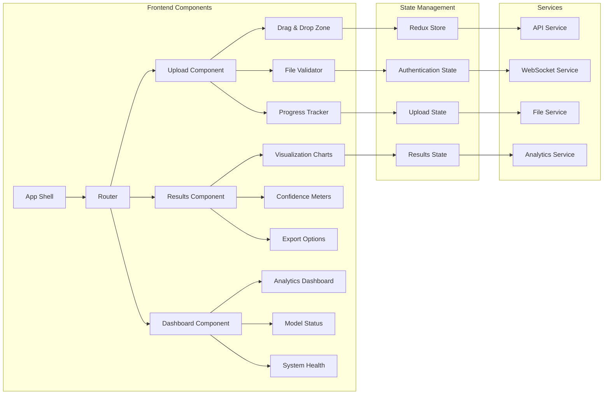

### 2. Backend Architecture

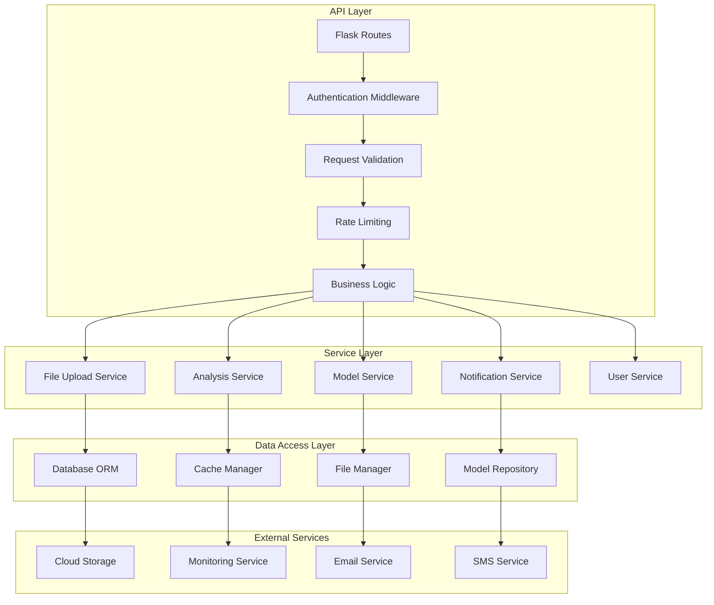

### 3. AI/ML Pipeline Architecture

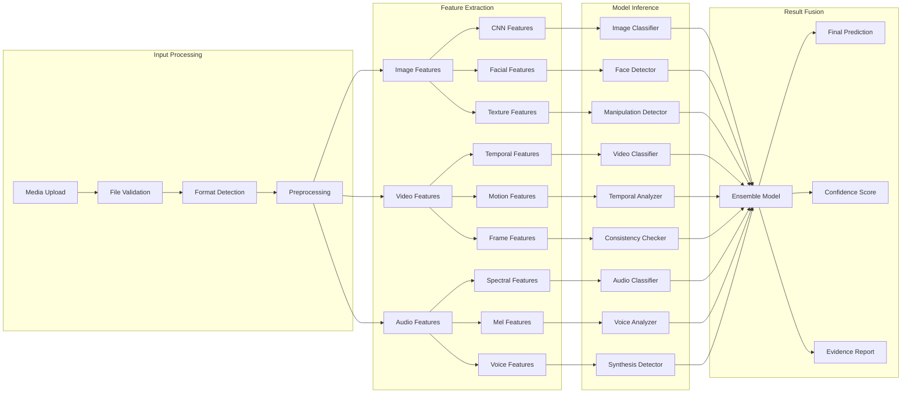

## 🗄️ Database Schema

### Core Tables

```sql
-- Users Table
CREATE TABLE users (
    id SERIAL PRIMARY KEY,
    username VARCHAR(50) UNIQUE NOT NULL,
    email VARCHAR(100) UNIQUE NOT NULL,
    password_hash VARCHAR(255) NOT NULL,
    created_at TIMESTAMP DEFAULT CURRENT_TIMESTAMP,
    updated_at TIMESTAMP DEFAULT CURRENT_TIMESTAMP,
    is_active BOOLEAN DEFAULT TRUE,
    role VARCHAR(20) DEFAULT 'user'
);

-- Analysis Jobs Table
CREATE TABLE analysis_jobs (
    id UUID PRIMARY KEY DEFAULT gen_random_uuid(),
    user_id INTEGER REFERENCES users(id),
    file_name VARCHAR(255) NOT NULL,
    file_path VARCHAR(500) NOT NULL,
    file_type VARCHAR(10) NOT NULL,
    file_size BIGINT NOT NULL,
    status VARCHAR(20) DEFAULT 'pending',
    created_at TIMESTAMP DEFAULT CURRENT_TIMESTAMP,
    started_at TIMESTAMP,
    completed_at TIMESTAMP,
    error_message TEXT
);

-- Analysis Results Table
CREATE TABLE analysis_results (
    id UUID PRIMARY KEY DEFAULT gen_random_uuid(),
    job_id UUID REFERENCES analysis_jobs(id),
    prediction VARCHAR(20) NOT NULL,
    confidence DECIMAL(5,4) NOT NULL,
    is_authentic BOOLEAN NOT NULL,
    models_used TEXT[],
    processing_time DECIMAL(8,2),
    features_detected JSONB,
    evidence_data JSONB,
    created_at TIMESTAMP DEFAULT CURRENT_TIMESTAMP
);

-- Model Performance Table
CREATE TABLE model_performance (
    id SERIAL PRIMARY KEY,
    model_name VARCHAR(100) NOT NULL,
    version VARCHAR(20) NOT NULL,
    accuracy DECIMAL(5,4),
    precision_score DECIMAL(5,4),
    recall DECIMAL(5,4),
    f1_score DECIMAL(5,4),
    test_date TIMESTAMP DEFAULT CURRENT_TIMESTAMP,
    dataset_name VARCHAR(100)
);

-- System Logs Table
CREATE TABLE system_logs (
    id BIGSERIAL PRIMARY KEY,
    level VARCHAR(10) NOT NULL,
    message TEXT NOT NULL,
    module VARCHAR(100),
    function_name VARCHAR(100),
    user_id INTEGER REFERENCES users(id),
    ip_address INET,
    created_at TIMESTAMP DEFAULT CURRENT_TIMESTAMP,
    metadata JSONB
);
```

### Indexes for Performance

```sql
-- Performance Indexes
CREATE INDEX idx_analysis_jobs_user_id ON analysis_jobs(user_id);
CREATE INDEX idx_analysis_jobs_status ON analysis_jobs(status);
CREATE INDEX idx_analysis_jobs_created_at ON analysis_jobs(created_at);
CREATE INDEX idx_analysis_results_job_id ON analysis_results(job_id);
CREATE INDEX idx_analysis_results_prediction ON analysis_results(prediction);
CREATE INDEX idx_system_logs_created_at ON system_logs(created_at);
CREATE INDEX idx_system_logs_level ON system_logs(level);

-- Composite Indexes
CREATE INDEX idx_jobs_user_status ON analysis_jobs(user_id, status);
CREATE INDEX idx_results_prediction_confidence ON analysis_results(prediction, confidence);
```

## 🔄 Data Flow Architecture

### 1. File Upload Flow

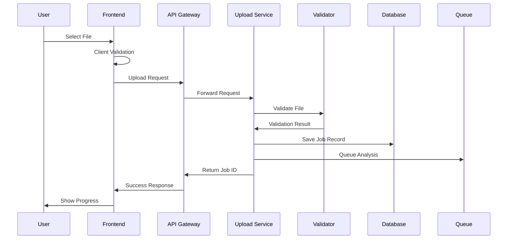

### 2. Analysis Processing Flow

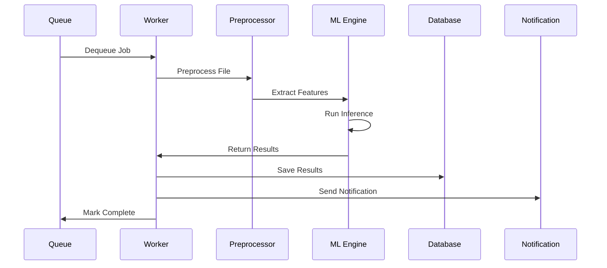

### 3. Real-time Updates Flow

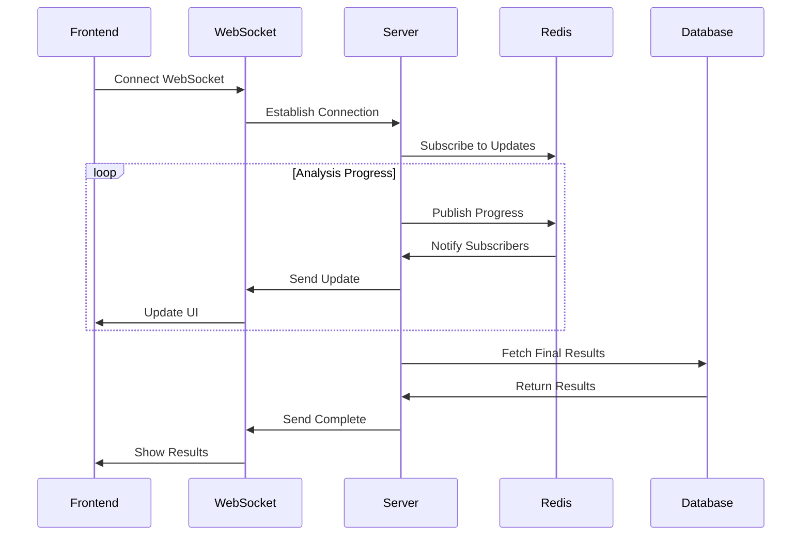

## ⚡ Performance Optimization

### 1. Caching Strategy

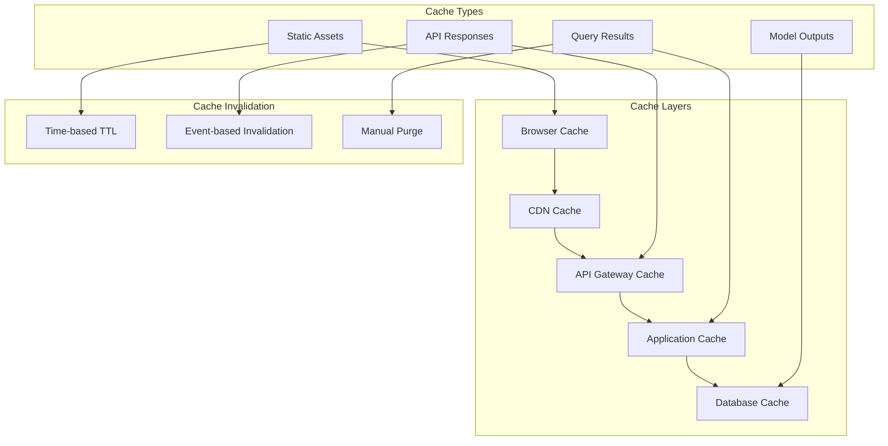

### 2. Scaling Strategy

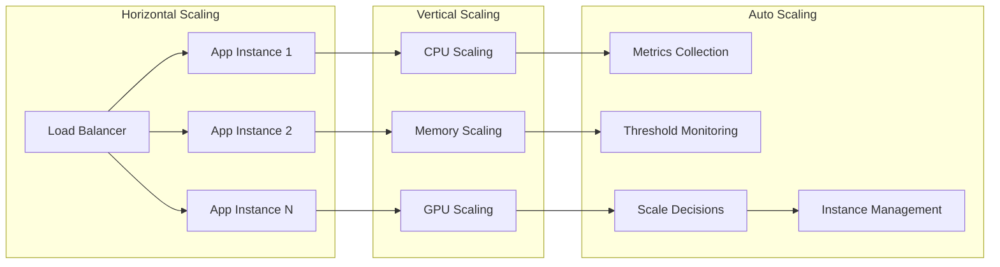

## 🔒 Security Architecture

### 1. Security Layers

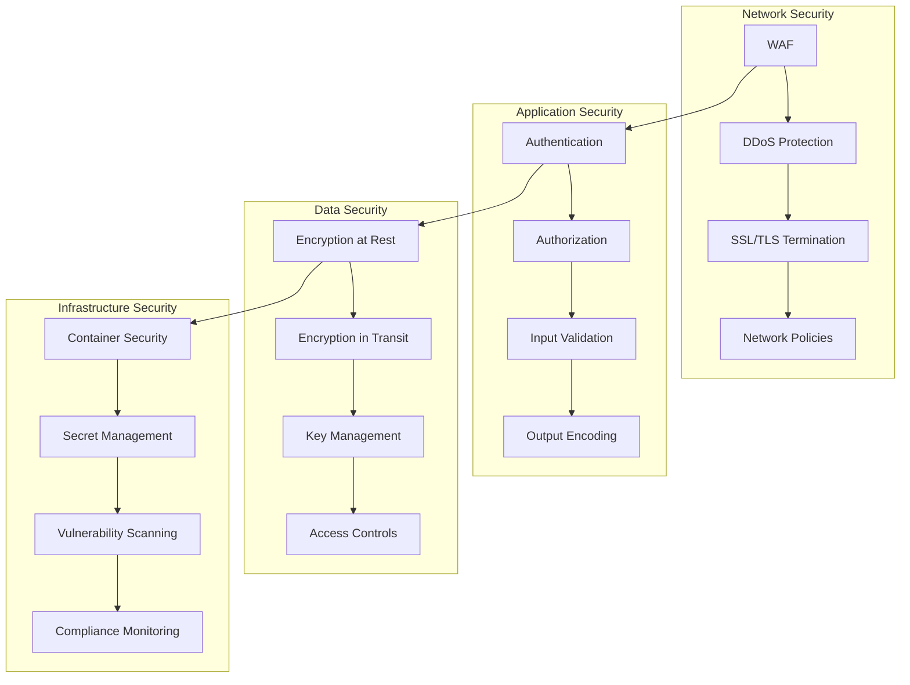

### 2. Authentication Flow

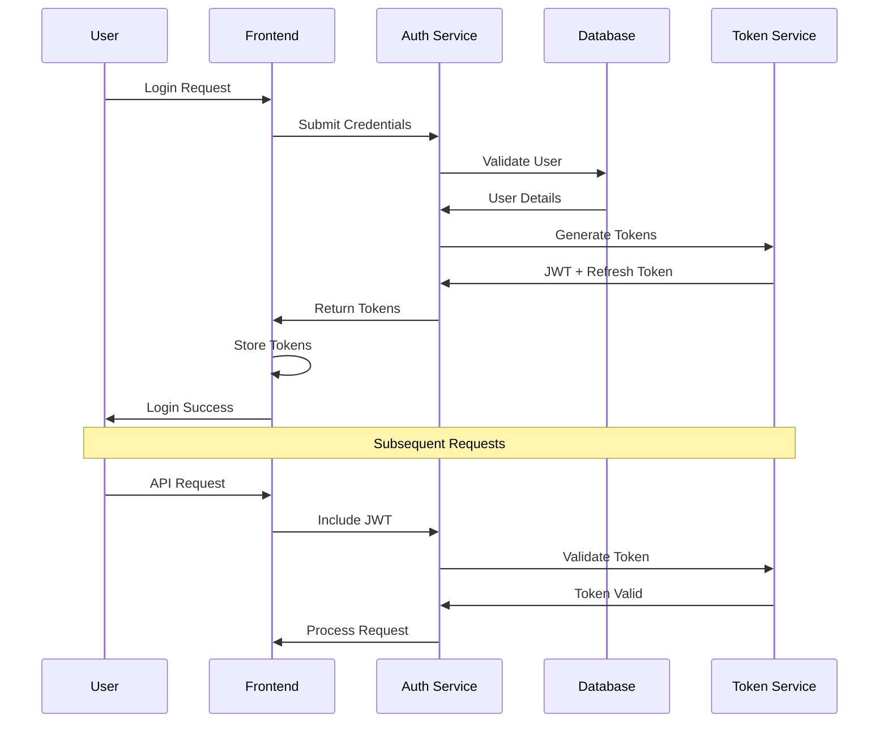

## 🚀 Deployment Architecture

### 1. Container Architecture

```dockerfile
# Multi-stage build example
FROM python:3.9-slim as base
WORKDIR /app
COPY requirements.txt .
RUN pip install --no-cache-dir -r requirements.txt

FROM base as development
COPY . .
ENV FLASK_ENV=development
CMD ["python", "app.py"]

FROM base as production
COPY . .
ENV FLASK_ENV=production
RUN adduser --disabled-password --gecos '' appuser
USER appuser
CMD ["gunicorn", "--bind", "0.0.0.0:5000", "app:app"]
```

### 2. Kubernetes Deployment

```yaml
apiVersion: apps/v1
kind: Deployment
metadata:
  name: deepfake-detector
spec:
  replicas: 3
  selector:
    matchLabels:
      app: deepfake-detector
  template:
    metadata:
      labels:
        app: deepfake-detector
    spec:
      containers:
      - name: app
        image: deepfake-detector:latest
        ports:
        - containerPort: 5000
        resources:
          requests:
            memory: "512Mi"
            cpu: "250m"
          limits:
            memory: "2Gi"
            cpu: "1000m"
        env:
        - name: DATABASE_URL
          valueFrom:
            secretKeyRef:
              name: app-secrets
              key: database-url
---
apiVersion: v1
kind: Service
metadata:
  name: deepfake-detector-service
spec:
  selector:
    app: deepfake-detector
  ports:
    - protocol: TCP
      port: 80
      targetPort: 5000
  type: LoadBalancer
```

## 📊 Monitoring & Observability

### 1. Metrics Collection

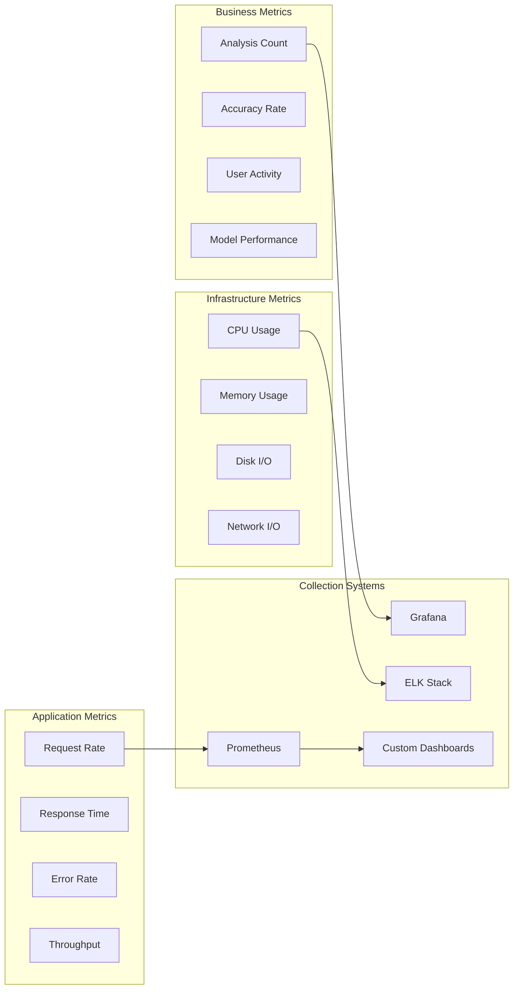

### 2. Logging Architecture

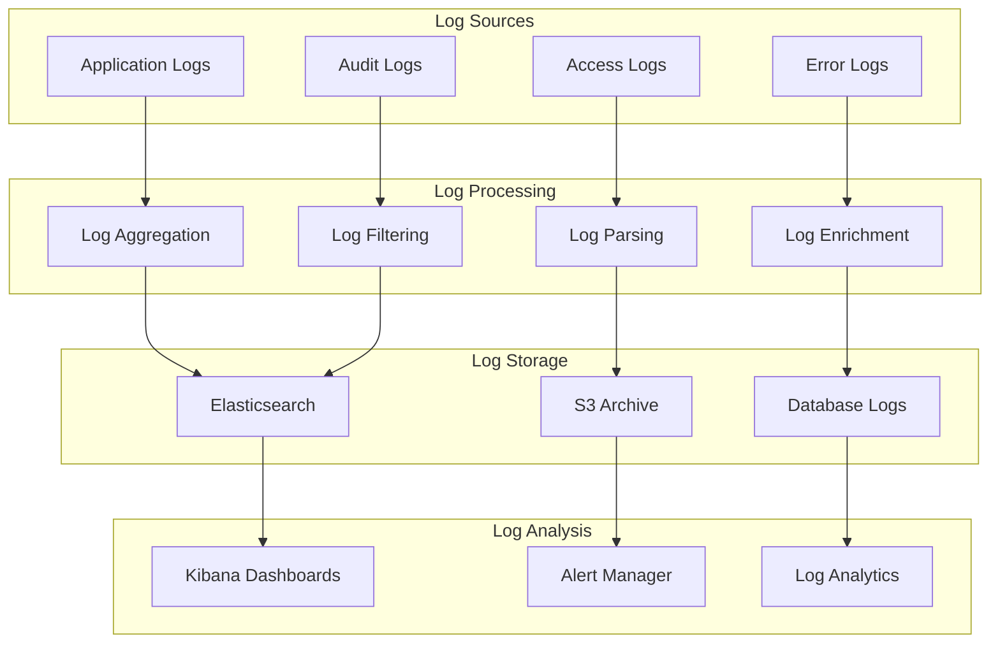

## 🎯 API Design Patterns


# OpenAPI 3.0 Specification Example
openapi: 3.0.0
info:
  title: DeepFake Detection API
  version: 1.0.0
  description: AI-powered deepfake detection service

paths:
  /api/v1/analyze:
    post:
      summary: Analyze media file
      requestBody:
        content:
          multipart/form-data:
            schema:
              type: object
              properties:
                file:
                  type: string
                  format: binary
                options:
                  type: object
                  properties:
                    detailed_analysis:
                      type: boolean
                    face_detection:
                      type: boolean
      responses:
        200:
          description: Analysis completed
          content:
            application/json:
              schema:
                type: object
                properties:
                  success:
                    type: boolean
                  job_id:
                    type: string
                  results:
                    type: object
                    properties:
                      prediction:
                        type: string
                      confidence:
                        type: number
                      is_authentic:
                        type: boolean
```

