# 🏗️ System Architecture & Technical Documentation

## 🌐 Complete System Architecture

### Master Architecture Diagram

```mermaid
graph TB
    %% Client Layer
    subgraph "🖥️ Client Layer"
        WEB["🌐 Web Browser<br/>React SPA"]
        MOBILE["📱 Mobile App<br/>React Native"]
        API_CLIENT["🔌 API Clients<br/>Third-party"]
        CLI["💻 CLI Tool<br/>Python CLI"]
    end
    
    %% Load Balancer & Edge
    subgraph "⚡ Edge & Load Balancing"
        CDN["🌍 CDN<br/>Static Assets"]
        WAF["🛡️ Web Application Firewall<br/>Security Filter"]
        LB["⚖️ Load Balancer<br/>Nginx/HAProxy"]
        RATE["🚦 Rate Limiter<br/>Redis-based"]
    end
    
    %% API Gateway
    subgraph "🚪 API Gateway Layer"
        GATEWAY["🚪 API Gateway<br/>Flask/FastAPI"]
        AUTH["🔐 Authentication<br/>JWT/OAuth2"]
        AUTHZ["🔒 Authorization<br/>RBAC"]
        VALID["✅ Request Validation<br/>Schema Validation"]
    end
    
    %% Application Services
    subgraph "🏢 Application Services"
        UPLOAD["📤 Upload Service<br/>File Management"]
        ANALYSIS["🔍 Analysis Service<br/>Job Orchestration"]
        NOTIFY["📢 Notification Service<br/>WebSocket/Email"]
        USER["👤 User Service<br/>Profile Management"]
        REPORT["📊 Reporting Service<br/>Analytics"]
    end
    
    %% AI/ML Processing
    subgraph "🧠 AI/ML Processing Engine"
        PREPROCESS["🔧 Preprocessor<br/>Media Normalization"]
        FEATURE["🎯 Feature Extractor<br/>CNN/Audio/Video"]
        
        subgraph "🤖 ML Models"
            IMG_MODEL["🖼️ Image Models<br/>CNN/Vision"]
            VID_MODEL["🎬 Video Models<br/>Temporal/3D CNN"]
            AUD_MODEL["🔊 Audio Models<br/>Spectral/RNN"]
        end
        
        ENSEMBLE["🎭 Ensemble Engine<br/>Model Fusion"]
        INFERENCE["⚡ Inference Engine<br/>GPU Accelerated"]
    end
    
    %% Data & Storage
    subgraph "🗄️ Data & Storage Layer"
        POSTGRES["🐘 PostgreSQL<br/>Metadata & Jobs"]
        REDIS["🔴 Redis Cache<br/>Session & Cache"]
        S3["☁️ Object Storage<br/>Files & Models"]
        ELASTIC["🔍 Elasticsearch<br/>Logs & Search"]
    end
    
    %% Message Queue
    subgraph "📬 Message Queue"
        QUEUE["📨 Job Queue<br/>Celery/RQ"]
        WORKER["⚙️ Worker Nodes<br/>Background Processing"]
        SCHEDULER["⏰ Task Scheduler<br/>Cron/APScheduler"]
    end
    
    %% Monitoring & Observability
    subgraph "📊 Monitoring & Observability"
        METRICS["📈 Metrics<br/>Prometheus"]
        LOGS["📝 Logging<br/>ELK Stack"]
        TRACE["🔍 Tracing<br/>Jaeger"]
        ALERT["🚨 Alerting<br/>AlertManager"]
        DASH["📊 Dashboards<br/>Grafana"]
    end
    
    %% Infrastructure
    subgraph "🏗️ Infrastructure Layer"
        DOCKER["🐳 Containers<br/>Docker"]
        K8S["☸️ Orchestration<br/>Kubernetes"]
        HELM["⚓ Package Manager<br/>Helm Charts"]
        SECRETS["🔐 Secret Management<br/>Vault/K8s Secrets"]
    end
    
    %% External Services
    subgraph "🌐 External Services"
        EMAIL["📧 Email Service<br/>SendGrid/SES"]
        SMS["📱 SMS Service<br/>Twilio"]
        STORAGE_EXT["☁️ Cloud Storage<br/>AWS S3/GCS"]
        MONITOR_EXT["📊 External Monitoring<br/>DataDog/NewRelic"]
    end
    
    %% Connections - Client to Edge
    WEB --> CDN
    MOBILE --> WAF
    API_CLIENT --> LB
    CLI --> RATE
    
    %% Edge to Gateway
    CDN --> GATEWAY
    WAF --> AUTH
    LB --> AUTHZ
    RATE --> VALID
    
    %% Gateway to Services
    GATEWAY --> UPLOAD
    AUTH --> ANALYSIS
    AUTHZ --> NOTIFY
    VALID --> USER
    GATEWAY --> REPORT
    
    %% Services to ML
    UPLOAD --> PREPROCESS
    ANALYSIS --> FEATURE
    PREPROCESS --> IMG_MODEL
    FEATURE --> VID_MODEL
    FEATURE --> AUD_MODEL
    IMG_MODEL --> ENSEMBLE
    VID_MODEL --> ENSEMBLE
    AUD_MODEL --> ENSEMBLE
    ENSEMBLE --> INFERENCE
    
    %% Services to Data
    UPLOAD --> S3
    ANALYSIS --> POSTGRES
    USER --> REDIS
    REPORT --> ELASTIC
    
    %% Queue System
    ANALYSIS --> QUEUE
    QUEUE --> WORKER
    WORKER --> INFERENCE
    WORKER --> SCHEDULER
    
    %% Monitoring Connections
    GATEWAY -.-> METRICS
    UPLOAD -.-> LOGS
    ANALYSIS -.-> TRACE
    INFERENCE -.-> ALERT
    METRICS --> DASH
    
    %% Infrastructure
    GATEWAY --- DOCKER
    UPLOAD --- K8S
    ANALYSIS --- HELM
    USER --- SECRETS
    
    %% External Services
    NOTIFY --> EMAIL
    NOTIFY --> SMS
    S3 --> STORAGE_EXT
    METRICS --> MONITOR_EXT
    
    %% Styling
    classDef clientStyle fill:#e1f5fe,stroke:#01579b,stroke-width:2px
    classDef edgeStyle fill:#f3e5f5,stroke:#4a148c,stroke-width:2px
    classDef gatewayStyle fill:#e8f5e8,stroke:#2e7d32,stroke-width:2px
    classDef serviceStyle fill:#fff3e0,stroke:#e65100,stroke-width:2px
    classDef mlStyle fill:#fce4ec,stroke:#ad1457,stroke-width:2px
    classDef dataStyle fill:#e0f2f1,stroke:#00695c,stroke-width:2px
    classDef queueStyle fill:#f1f8e9,stroke:#33691e,stroke-width:2px
    classDef monitorStyle fill:#fff8e1,stroke:#f57f17,stroke-width:2px
    classDef infraStyle fill:#efebe9,stroke:#3e2723,stroke-width:2px
    classDef externalStyle fill:#fafafa,stroke:#424242,stroke-width:2px
    
    class WEB,MOBILE,API_CLIENT,CLI clientStyle
    class CDN,WAF,LB,RATE edgeStyle
    class GATEWAY,AUTH,AUTHZ,VALID gatewayStyle
    class UPLOAD,ANALYSIS,NOTIFY,USER,REPORT serviceStyle
    class PREPROCESS,FEATURE,IMG_MODEL,VID_MODEL,AUD_MODEL,ENSEMBLE,INFERENCE mlStyle
    class POSTGRES,REDIS,S3,ELASTIC dataStyle
    class QUEUE,WORKER,SCHEDULER queueStyle
    class METRICS,LOGS,TRACE,ALERT,DASH monitorStyle
    class DOCKER,K8S,HELM,SECRETS infraStyle
    class EMAIL,SMS,STORAGE_EXT,MONITOR_EXT externalStyle
```



## 📊 Detailed Layer Architecture

### 1. Complete Data Flow Architecture


## 📊 High-Level Architecture Overview


## 🔧 Component Architecture

### 1. Frontend Architecture


### 2. Backend Architecture


### 3. AI/ML Pipeline Architecture


## 🗄️ Database Schema

### Core Tables

```sql
-- Users Table
CREATE TABLE users (
    id SERIAL PRIMARY KEY,
    username VARCHAR(50) UNIQUE NOT NULL,
    email VARCHAR(100) UNIQUE NOT NULL,
    password_hash VARCHAR(255) NOT NULL,
    created_at TIMESTAMP DEFAULT CURRENT_TIMESTAMP,
    updated_at TIMESTAMP DEFAULT CURRENT_TIMESTAMP,
    is_active BOOLEAN DEFAULT TRUE,
    role VARCHAR(20) DEFAULT 'user'
);

-- Analysis Jobs Table
CREATE TABLE analysis_jobs (
    id UUID PRIMARY KEY DEFAULT gen_random_uuid(),
    user_id INTEGER REFERENCES users(id),
    file_name VARCHAR(255) NOT NULL,
    file_path VARCHAR(500) NOT NULL,
    file_type VARCHAR(10) NOT NULL,
    file_size BIGINT NOT NULL,
    status VARCHAR(20) DEFAULT 'pending',
    created_at TIMESTAMP DEFAULT CURRENT_TIMESTAMP,
    started_at TIMESTAMP,
    completed_at TIMESTAMP,
    error_message TEXT
);

-- Analysis Results Table
CREATE TABLE analysis_results (
    id UUID PRIMARY KEY DEFAULT gen_random_uuid(),
    job_id UUID REFERENCES analysis_jobs(id),
    prediction VARCHAR(20) NOT NULL,
    confidence DECIMAL(5,4) NOT NULL,
    is_authentic BOOLEAN NOT NULL,
    models_used TEXT[],
    processing_time DECIMAL(8,2),
    features_detected JSONB,
    evidence_data JSONB,
    created_at TIMESTAMP DEFAULT CURRENT_TIMESTAMP
);

-- Model Performance Table
CREATE TABLE model_performance (
    id SERIAL PRIMARY KEY,
    model_name VARCHAR(100) NOT NULL,
    version VARCHAR(20) NOT NULL,
    accuracy DECIMAL(5,4),
    precision_score DECIMAL(5,4),
    recall DECIMAL(5,4),
    f1_score DECIMAL(5,4),
    test_date TIMESTAMP DEFAULT CURRENT_TIMESTAMP,
    dataset_name VARCHAR(100)
);

-- System Logs Table
CREATE TABLE system_logs (
    id BIGSERIAL PRIMARY KEY,
    level VARCHAR(10) NOT NULL,
    message TEXT NOT NULL,
    module VARCHAR(100),
    function_name VARCHAR(100),
    user_id INTEGER REFERENCES users(id),
    ip_address INET,
    created_at TIMESTAMP DEFAULT CURRENT_TIMESTAMP,
    metadata JSONB
);
```

### Indexes for Performance

```sql
-- Performance Indexes
CREATE INDEX idx_analysis_jobs_user_id ON analysis_jobs(user_id);
CREATE INDEX idx_analysis_jobs_status ON analysis_jobs(status);
CREATE INDEX idx_analysis_jobs_created_at ON analysis_jobs(created_at);
CREATE INDEX idx_analysis_results_job_id ON analysis_results(job_id);
CREATE INDEX idx_analysis_results_prediction ON analysis_results(prediction);
CREATE INDEX idx_system_logs_created_at ON system_logs(created_at);
CREATE INDEX idx_system_logs_level ON system_logs(level);

-- Composite Indexes
CREATE INDEX idx_jobs_user_status ON analysis_jobs(user_id, status);
CREATE INDEX idx_results_prediction_confidence ON analysis_results(prediction, confidence);
```

## 🔄 Data Flow Architecture

### 1. File Upload Flow


### 2. Analysis Processing Flow


### 3. Real-time Updates Flow


## ⚡ Performance Optimization

### 1. Caching Strategy


### 2. Scaling Strategy


## 🔒 Security Architecture

### 1. Security Layers


### 2. Authentication Flow


## 🚀 Deployment Architecture

### 1. Container Architecture

```dockerfile
# Multi-stage build example
FROM python:3.9-slim as base
WORKDIR /app
COPY requirements.txt .
RUN pip install --no-cache-dir -r requirements.txt

FROM base as development
COPY . .
ENV FLASK_ENV=development
CMD ["python", "app.py"]

FROM base as production
COPY . .
ENV FLASK_ENV=production
RUN adduser --disabled-password --gecos '' appuser
USER appuser
CMD ["gunicorn", "--bind", "0.0.0.0:5000", "app:app"]
```

### 2. Kubernetes Deployment

```yaml
apiVersion: apps/v1
kind: Deployment
metadata:
  name: deepfake-detector
spec:
  replicas: 3
  selector:
    matchLabels:
      app: deepfake-detector
  template:
    metadata:
      labels:
        app: deepfake-detector
    spec:
      containers:
      - name: app
        image: deepfake-detector:latest
        ports:
        - containerPort: 5000
        resources:
          requests:
            memory: "512Mi"
            cpu: "250m"
          limits:
            memory: "2Gi"
            cpu: "1000m"
        env:
        - name: DATABASE_URL
          valueFrom:
            secretKeyRef:
              name: app-secrets
              key: database-url
---
apiVersion: v1
kind: Service
metadata:
  name: deepfake-detector-service
spec:
  selector:
    app: deepfake-detector
  ports:
    - protocol: TCP
      port: 80
      targetPort: 5000
  type: LoadBalancer
```

## 📊 Monitoring & Observability

### 1. Metrics Collection


### 2. Logging Architecture


## 🏗️ Complete Infrastructure Architecture

### Kubernetes Deployment Architecture

```mermaid
graph TB
    %% Kubernetes Cluster
    subgraph "☸️ Kubernetes Cluster"
        subgraph "🌐 Ingress Layer"
            INGRESS["🚪 Ingress Controller<br/>NGINX/Traefik"]
            TLS["🔒 TLS Termination<br/>cert-manager"]
        end
        
        subgraph "🏢 Application Namespace"
            subgraph "🚪 Gateway Services"
                GATEWAY_POD["🚪 API Gateway<br/>Deployment: 3 replicas"]
                AUTH_POD["🔐 Auth Service<br/>Deployment: 2 replicas"]
            end
            
            subgraph "⚙️ Core Services"
                UPLOAD_POD["📤 Upload Service<br/>Deployment: 3 replicas"]
                ANALYSIS_POD["🔍 Analysis Service<br/>Deployment: 5 replicas"]
                NOTIFY_POD["📢 Notification Service<br/>Deployment: 2 replicas"]
            end
            
            subgraph "🧠 ML Services"
                ML_POD["🤖 ML Inference<br/>StatefulSet: 3 replicas<br/>GPU Nodes"]
                PREPROCESS_POD["🔧 Preprocessor<br/>Deployment: 4 replicas"]
            end
            
            subgraph "📬 Queue Services"
                WORKER_POD["⚙️ Worker Nodes<br/>Deployment: 10 replicas<br/>CPU Intensive"]
                SCHEDULER_POD["⏰ Scheduler<br/>CronJob"]
            end
        end
        
        subgraph "🗄️ Data Namespace"
            POSTGRES_STS["🐘 PostgreSQL<br/>StatefulSet<br/>Persistent Storage"]
            REDIS_STS["🔴 Redis Cluster<br/>StatefulSet: 6 replicas<br/>Master-Slave"]
        end
        
        subgraph "📊 Monitoring Namespace"
            PROMETHEUS["📈 Prometheus<br/>StatefulSet"]
            GRAFANA["📊 Grafana<br/>Deployment"]
            JAEGER["🔍 Jaeger<br/>DaemonSet"]
            ELASTIC["🔍 Elasticsearch<br/>StatefulSet: 3 replicas"]
        end
        
        subgraph "📋 ConfigMaps & Secrets"
            CONFIG["⚙️ ConfigMaps<br/>App Configuration"]
            SECRETS["🔐 Secrets<br/>API Keys, Passwords"]
            PV["💾 Persistent Volumes<br/>Storage Classes"]
        end
    end
    
    %% External Services
    subgraph "🌐 External Services"
        S3["☁️ AWS S3<br/>Object Storage"]
        EMAIL_SVC["📧 Email Service<br/>SendGrid"]
        SMS_SVC["📱 SMS Service<br/>Twilio"]
        MONITORING["📊 External Monitoring<br/>DataDog"]
    end
    
    %% Load Balancer
    LB["⚖️ Cloud Load Balancer<br/>AWS ALB/GCP LB"]
    
    %% Connections
    LB --> INGRESS
    INGRESS --> TLS
    TLS --> GATEWAY_POD
    
    GATEWAY_POD --> AUTH_POD
    GATEWAY_POD --> UPLOAD_POD
    GATEWAY_POD --> ANALYSIS_POD
    GATEWAY_POD --> NOTIFY_POD
    
    ANALYSIS_POD --> ML_POD
    ANALYSIS_POD --> PREPROCESS_POD
    ANALYSIS_POD --> WORKER_POD
    
    UPLOAD_POD --> POSTGRES_STS
    ANALYSIS_POD --> REDIS_STS
    AUTH_POD --> POSTGRES_STS
    
    ML_POD --> S3
    NOTIFY_POD --> EMAIL_SVC
    NOTIFY_POD --> SMS_SVC
    
    %% Monitoring Connections
    GATEWAY_POD -.-> PROMETHEUS
    ANALYSIS_POD -.-> ELASTIC
    ML_POD -.-> JAEGER
    PROMETHEUS --> GRAFANA
    GRAFANA --> MONITORING
    
    %% Configuration
    GATEWAY_POD -.-> CONFIG
    AUTH_POD -.-> SECRETS
    POSTGRES_STS -.-> PV
    
    %% Styling
    classDef k8sStyle fill:#e3f2fd,stroke:#1976d2,stroke-width:2px
    classDef serviceStyle fill:#e8f5e8,stroke:#388e3c,stroke-width:2px
    classDef dataStyle fill:#fff3e0,stroke:#f57c00,stroke-width:2px
    classDef monitorStyle fill:#f3e5f5,stroke:#7b1fa2,stroke-width:2px
    classDef configStyle fill:#fff8e1,stroke:#fbc02d,stroke-width:2px
    classDef externalStyle fill:#fafafa,stroke:#616161,stroke-width:2px
    
    class INGRESS,TLS k8sStyle
    class GATEWAY_POD,AUTH_POD,UPLOAD_POD,ANALYSIS_POD,NOTIFY_POD,ML_POD,PREPROCESS_POD,WORKER_POD,SCHEDULER_POD serviceStyle
    class POSTGRES_STS,REDIS_STS dataStyle
    class PROMETHEUS,GRAFANA,JAEGER,ELASTIC monitorStyle
    class CONFIG,SECRETS,PV configStyle
    class S3,EMAIL_SVC,SMS_SVC,MONITORING,LB externalStyle
```



### Microservices Communication Architecture

```mermaid
graph TB
    %% Client Layer
    subgraph "📱 Client Applications"
        WEB_APP["🌐 Web Application<br/>React SPA"]
        MOBILE_APP["📱 Mobile App<br/>React Native"]
        CLI_APP["💻 CLI Tool<br/>Python"]
    end
    
    %% API Gateway
    subgraph "🚪 API Gateway"
        GATEWAY["🚪 Gateway Service<br/>Kong/Ambassador"]
        subgraph "🔐 Security Layer"
            AUTH_SVC["🔐 Authentication<br/>OAuth2/JWT"]
            AUTHZ_SVC["🔒 Authorization<br/>RBAC/ABAC"]
            RATE_SVC["🚦 Rate Limiting<br/>Redis-based"]
        end
    end
    
    %% Core Business Services
    subgraph "🏢 Core Services"
        USER_SVC["👤 User Service<br/>Profile Management"]
        FILE_SVC["📁 File Service<br/>Upload/Storage"]
        JOB_SVC["📋 Job Service<br/>Analysis Management"]
        RESULT_SVC["📊 Result Service<br/>Output Management"]
    end
    
    %% AI/ML Services
    subgraph "🧠 AI/ML Services"
        PREPROC_SVC["🔧 Preprocessing<br/>Media Normalization"]
        
        subgraph "🎯 Detection Services"
            IMG_SVC["🖼️ Image Detection<br/>CNN Models"]
            VID_SVC["🎬 Video Detection<br/>Temporal Models"]
            AUD_SVC["🔊 Audio Detection<br/>Spectral Models"]
        end
        
        ENSEMBLE_SVC["🎭 Ensemble Service<br/>Model Fusion"]
        MODEL_SVC["🤖 Model Management<br/>Version Control"]
    end
    
    %% Support Services
    subgraph "🛠️ Support Services"
        NOTIFY_SVC["📢 Notification<br/>Email/SMS/WebSocket"]
        REPORT_SVC["📊 Reporting<br/>Analytics/Export"]
        AUDIT_SVC["📝 Audit Service<br/>Compliance Logging"]
        HEALTH_SVC["❤️ Health Check<br/>Service Monitoring"]
    end
    
    %% Message Queue
    subgraph "📬 Message Queue"
        QUEUE["📨 Message Broker<br/>RabbitMQ/Kafka"]
        subgraph "⚙️ Queue Topics"
            UPLOAD_Q["📤 Upload Queue"]
            ANALYSIS_Q["🔍 Analysis Queue"]
            RESULT_Q["📊 Result Queue"]
            NOTIFY_Q["📢 Notification Queue"]
        end
    end
    
    %% Data Services
    subgraph "🗄️ Data Services"
        DB_SVC["🐘 Database Service<br/>PostgreSQL"]
        CACHE_SVC["⚡ Cache Service<br/>Redis Cluster"]
        STORAGE_SVC["💾 Storage Service<br/>S3/MinIO"]
        SEARCH_SVC["🔍 Search Service<br/>Elasticsearch"]
    end
    
    %% Communication Patterns
    
    %% Client to Gateway
    WEB_APP --> GATEWAY
    MOBILE_APP --> GATEWAY
    CLI_APP --> GATEWAY
    
    %% Gateway Security Flow
    GATEWAY --> AUTH_SVC
    AUTH_SVC --> AUTHZ_SVC
    AUTHZ_SVC --> RATE_SVC
    
    %% Gateway to Core Services
    GATEWAY --> USER_SVC
    GATEWAY --> FILE_SVC
    GATEWAY --> JOB_SVC
    GATEWAY --> RESULT_SVC
    
    %% Core Services to Queue
    FILE_SVC --> UPLOAD_Q
    JOB_SVC --> ANALYSIS_Q
    RESULT_SVC --> RESULT_Q
    
    %% Queue to AI Services
    UPLOAD_Q --> PREPROC_SVC
    ANALYSIS_Q --> IMG_SVC
    ANALYSIS_Q --> VID_SVC
    ANALYSIS_Q --> AUD_SVC
    
    %% AI Services Flow
    PREPROC_SVC --> IMG_SVC
    PREPROC_SVC --> VID_SVC
    PREPROC_SVC --> AUD_SVC
    IMG_SVC --> ENSEMBLE_SVC
    VID_SVC --> ENSEMBLE_SVC
    AUD_SVC --> ENSEMBLE_SVC
    
    %% Results Flow
    ENSEMBLE_SVC --> RESULT_Q
    RESULT_Q --> RESULT_SVC
    RESULT_SVC --> NOTIFY_Q
    NOTIFY_Q --> NOTIFY_SVC
    
    %% Support Services
    RESULT_SVC --> REPORT_SVC
    USER_SVC --> AUDIT_SVC
    GATEWAY --> HEALTH_SVC
    
    %% Data Access
    USER_SVC <--> DB_SVC
    FILE_SVC <--> STORAGE_SVC
    JOB_SVC <--> DB_SVC
    RESULT_SVC <--> DB_SVC
    
    %% Caching
    USER_SVC <--> CACHE_SVC
    RESULT_SVC <--> CACHE_SVC
    ENSEMBLE_SVC <--> CACHE_SVC
    
    %% Search
    RESULT_SVC <--> SEARCH_SVC
    AUDIT_SVC <--> SEARCH_SVC
    
    %% Model Management
    IMG_SVC <--> MODEL_SVC
    VID_SVC <--> MODEL_SVC
    AUD_SVC <--> MODEL_SVC
    MODEL_SVC <--> STORAGE_SVC
    
    %% Styling
    classDef clientStyle fill:#e1f5fe,stroke:#01579b,stroke-width:2px
    classDef gatewayStyle fill:#e8f5e8,stroke:#2e7d32,stroke-width:2px
    classDef coreStyle fill:#fff3e0,stroke:#e65100,stroke-width:2px
    classDef aiStyle fill:#fce4ec,stroke:#ad1457,stroke-width:2px
    classDef supportStyle fill:#f3e5f5,stroke:#4a148c,stroke-width:2px
    classDef queueStyle fill:#f1f8e9,stroke:#33691e,stroke-width:2px
    classDef dataStyle fill:#e0f2f1,stroke:#00695c,stroke-width:2px
    
    class WEB_APP,MOBILE_APP,CLI_APP clientStyle
    class GATEWAY,AUTH_SVC,AUTHZ_SVC,RATE_SVC gatewayStyle
    class USER_SVC,FILE_SVC,JOB_SVC,RESULT_SVC coreStyle
    class PREPROC_SVC,IMG_SVC,VID_SVC,AUD_SVC,ENSEMBLE_SVC,MODEL_SVC aiStyle
    class NOTIFY_SVC,REPORT_SVC,AUDIT_SVC,HEALTH_SVC supportStyle
    class QUEUE,UPLOAD_Q,ANALYSIS_Q,RESULT_Q,NOTIFY_Q queueStyle
    class DB_SVC,CACHE_SVC,STORAGE_SVC,SEARCH_SVC dataStyle
```



## 🎯 API Design Patterns

### RESTful API Architecture

```mermaid
graph LR
    subgraph "🌐 API Endpoints"
        subgraph "🔐 Authentication"
            AUTH_LOGIN["/auth/login<br/>POST"]
            AUTH_REFRESH["/auth/refresh<br/>POST"]
            AUTH_LOGOUT["/auth/logout<br/>POST"]
        end
        
        subgraph "👤 User Management"
            USER_PROFILE["/users/profile<br/>GET/PUT"]
            USER_SETTINGS["/users/settings<br/>GET/PATCH"]
        end
        
        subgraph "📁 File Operations"
            FILE_UPLOAD["/files/upload<br/>POST"]
            FILE_STATUS["/files/{id}/status<br/>GET"]
            FILE_DOWNLOAD["/files/{id}/download<br/>GET"]
        end
        
        subgraph "🔍 Analysis Operations"
            ANALYSIS_CREATE["/analysis<br/>POST"]
            ANALYSIS_STATUS["/analysis/{id}<br/>GET"]
            ANALYSIS_RESULTS["/analysis/{id}/results<br/>GET"]
            ANALYSIS_LIST["/analysis<br/>GET"]
        end
        
        subgraph "📊 Results & Reports"
            RESULTS_EXPORT["/results/{id}/export<br/>GET"]
            REPORTS_GENERATE["/reports<br/>POST"]
            ANALYTICS["/analytics<br/>GET"]
        end
        
        subgraph "🤖 Model Management"
            MODELS_LIST["/models<br/>GET"]
            MODELS_STATUS["/models/{id}/status<br/>GET"]
            MODELS_METRICS["/models/{id}/metrics<br/>GET"]
        end
        
        subgraph "🔌 Real-time"
            WEBSOCKET["/ws/analysis/{id}<br/>WebSocket"]
            SSE["/sse/progress/{id}<br/>Server-Sent Events"]
        end
    end
    
    subgraph "📡 API Gateway Features"
        VERSIONING["📋 API Versioning<br/>v1, v2"]
        RATE_LIMITING["🚦 Rate Limiting<br/>Per User/IP"]
        CACHING["⚡ Response Caching<br/>Redis-based"]
        VALIDATION["✅ Request Validation<br/>JSON Schema"]
        CORS["🌐 CORS Handling<br/>Cross-origin"]
        COMPRESSION["🗜️ Response Compression<br/>gzip/brotli"]
    end
    
    %% API Features
    AUTH_LOGIN --> VERSIONING
    FILE_UPLOAD --> RATE_LIMITING
    ANALYSIS_STATUS --> CACHING
    ANALYSIS_CREATE --> VALIDATION
    WEBSOCKET --> CORS
    RESULTS_EXPORT --> COMPRESSION
```



### OpenAPI 3.0 Specification

```yaml
openapi: 3.0.0
info:
  title: DeepFake Detection API
  version: 2.0.0
  description: |
    Advanced AI-powered deepfake detection service with multi-modal analysis capabilities.
    
    ## Features
    - Multi-format support (images, videos, audio)
    - Real-time processing with WebSocket updates
    - Ensemble model predictions with confidence scores
    - Comprehensive audit logging and analytics
    
  contact:
    name: API Support
    email: api-support@deepfakedetection.com
    url: https://docs.deepfakedetection.com
  license:
    name: MIT
    url: https://opensource.org/licenses/MIT

servers:
  - url: https://api.deepfakedetection.com/v2
    description: Production server
  - url: https://staging-api.deepfakedetection.com/v2
    description: Staging server

security:
  - BearerAuth: []
  - ApiKeyAuth: []

paths:
  /analysis:
    post:
      summary: Create new analysis job
      description: |
        Submit a media file for deepfake analysis. Supports images, videos, and audio files.
        Returns a job ID for tracking progress and retrieving results.
      tags:
        - Analysis
      requestBody:
        required: true
        content:
          multipart/form-data:
            schema:
              type: object
              required:
                - file
              properties:
                file:
                  type: string
                  format: binary
                  description: Media file to analyze (max 100MB)
                options:
                  $ref: '#/components/schemas/AnalysisOptions'
                metadata:
                  type: object
                  description: Additional metadata for the analysis
                  properties:
                    source:
                      type: string
                      description: Source of the media file
                    tags:
                      type: array
                      items:
                        type: string
                      description: Tags for categorization
      responses:
        '201':
          description: Analysis job created successfully
          content:
            application/json:
              schema:
                $ref: '#/components/schemas/AnalysisJob'
        '400':
          $ref: '#/components/responses/BadRequest'
        '401':
          $ref: '#/components/responses/Unauthorized'
        '413':
          $ref: '#/components/responses/PayloadTooLarge'
        '429':
          $ref: '#/components/responses/TooManyRequests'
    
    get:
      summary: List analysis jobs
      description: Retrieve a paginated list of analysis jobs for the authenticated user
      tags:
        - Analysis
      parameters:
        - name: page
          in: query
          schema:
            type: integer
            default: 1
            minimum: 1
        - name: limit
          in: query
          schema:
            type: integer
            default: 20
            minimum: 1
            maximum: 100
        - name: status
          in: query
          schema:
            $ref: '#/components/schemas/JobStatus'
        - name: sort
          in: query
          schema:
            type: string
            enum: [created_at, updated_at, confidence]
            default: created_at
        - name: order
          in: query
          schema:
            type: string
            enum: [asc, desc]
            default: desc
      responses:
        '200':
          description: List of analysis jobs
          content:
            application/json:
              schema:
                type: object
                properties:
                  data:
                    type: array
                    items:
                      $ref: '#/components/schemas/AnalysisJob'
                  pagination:
                    $ref: '#/components/schemas/Pagination'

  /analysis/{jobId}:
    get:
      summary: Get analysis job details
      description: Retrieve detailed information about a specific analysis job
      tags:
        - Analysis
      parameters:
        - name: jobId
          in: path
          required: true
          schema:
            type: string
            format: uuid
      responses:
        '200':
          description: Analysis job details
          content:
            application/json:
              schema:
                $ref: '#/components/schemas/AnalysisJobDetail'
        '404':
          $ref: '#/components/responses/NotFound'

  /analysis/{jobId}/results:
    get:
      summary: Get analysis results
      description: Retrieve the results of a completed analysis job
      tags:
        - Analysis
      parameters:
        - name: jobId
          in: path
          required: true
          schema:
            type: string
            format: uuid
        - name: format
          in: query
          schema:
            type: string
            enum: [json, pdf, csv]
            default: json
      responses:
        '200':
          description: Analysis results
          content:
            application/json:
              schema:
                $ref: '#/components/schemas/AnalysisResult'
            application/pdf:
              schema:
                type: string
                format: binary
            text/csv:
              schema:
                type: string

components:
  schemas:
    AnalysisOptions:
      type: object
      properties:
        models:
          type: array
          items:
            type: string
            enum: [cnn_v2, temporal_v1, audio_v3, ensemble]
          description: Specific models to use for analysis
        detailed_analysis:
          type: boolean
          default: false
          description: Enable detailed feature analysis
        face_detection:
          type: boolean
          default: true
          description: Enable facial region detection
        confidence_threshold:
          type: number
          minimum: 0.0
          maximum: 1.0
          default: 0.5
          description: Minimum confidence threshold for predictions
        priority:
          type: string
          enum: [low, normal, high, urgent]
          default: normal
          description: Processing priority
    
    AnalysisJob:
      type: object
      properties:
        id:
          type: string
          format: uuid
          description: Unique job identifier
        user_id:
          type: string
          description: User who created the job
        filename:
          type: string
          description: Original filename
        file_type:
          type: string
          enum: [image, video, audio]
        file_size:
          type: integer
          description: File size in bytes
        status:
          $ref: '#/components/schemas/JobStatus'
        created_at:
          type: string
          format: date-time
        updated_at:
          type: string
          format: date-time
        estimated_completion:
          type: string
          format: date-time
          nullable: true
        progress:
          type: integer
          minimum: 0
          maximum: 100
          description: Processing progress percentage
    
    JobStatus:
      type: string
      enum:
        - pending
        - queued
        - processing
        - completed
        - failed
        - cancelled
    
    AnalysisResult:
      type: object
      properties:
        job_id:
          type: string
          format: uuid
        prediction:
          type: string
          enum: [authentic, deepfake, unknown]
        confidence:
          type: number
          minimum: 0.0
          maximum: 1.0
          description: Overall confidence score
        is_authentic:
          type: boolean
          description: Binary authenticity prediction
        models_used:
          type: array
          items:
            type: string
          description: List of models used in analysis
        processing_time:
          type: number
          description: Processing time in seconds
        evidence:
          type: object
          description: Detailed evidence and explanations
          properties:
            facial_inconsistencies:
              type: number
              minimum: 0.0
              maximum: 1.0
            temporal_artifacts:
              type: number
              minimum: 0.0
              maximum: 1.0
            compression_anomalies:
              type: number
              minimum: 0.0
              maximum: 1.0
            feature_maps:
              type: array
              items:
                type: object
                properties:
                  layer:
                    type: string
                  activation_map:
                    type: string
                    format: base64
        metadata:
          type: object
          description: File and analysis metadata
        created_at:
          type: string
          format: date-time
  
  securitySchemes:
    BearerAuth:
      type: http
      scheme: bearer
      bearerFormat: JWT
    ApiKeyAuth:
      type: apiKey
      in: header
      name: X-API-Key
  
  responses:
    BadRequest:
      description: Bad request - invalid parameters
      content:
        application/json:
          schema:
            type: object
            properties:
              error:
                type: string
              details:
                type: array
                items:
                  type: string
    
    Unauthorized:
      description: Authentication required
      content:
        application/json:
          schema:
            type: object
            properties:
              error:
                type: string
                default: "Authentication required"
    
    NotFound:
      description: Resource not found
      content:
        application/json:
          schema:
            type: object
            properties:
              error:
                type: string
                default: "Resource not found"
    
    PayloadTooLarge:
      description: File too large
      content:
        application/json:
          schema:
            type: object
            properties:
              error:
                type: string
                default: "File size exceeds maximum limit"
    
    TooManyRequests:
      description: Rate limit exceeded
      content:
        application/json:
          schema:
            type: object
            properties:
              error:
                type: string
                default: "Rate limit exceeded"
              retry_after:
                type: integer
                description: Seconds to wait before retrying
```

